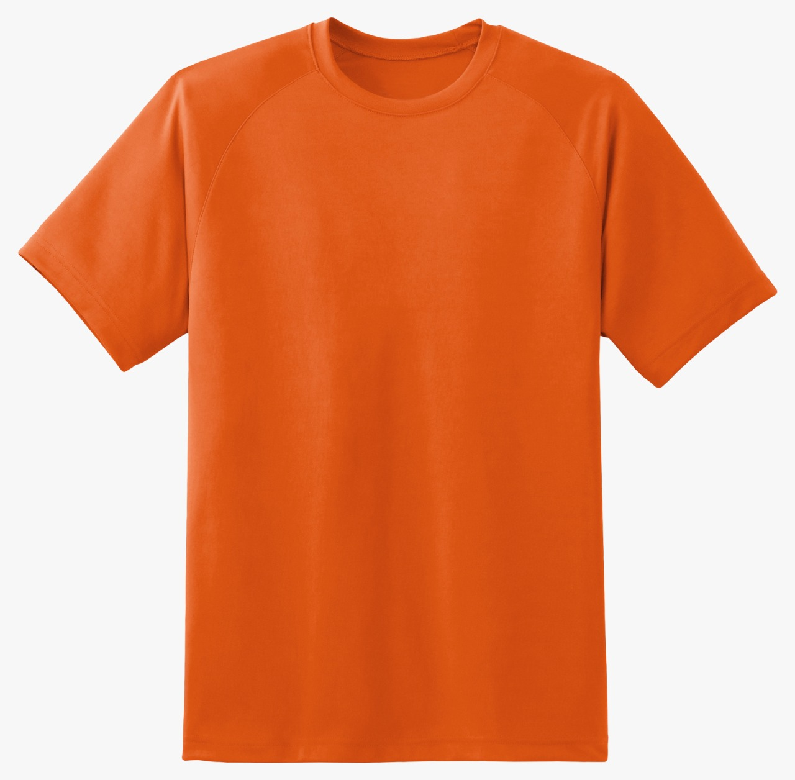

# B2Me — Electrothon 2021

> **Pick the colour. Order the garment. An e-commerce concept built around hex codes, not stock photos.**


[Live demo (Netlify)](https://b2me.netlify.app/)

## About

- **What:** B2Me is a web app concept that lets shoppers preview garments in any colour they like — not just the four shades the photographer happened to shoot — by typing a hex code or pulling from a palette.
- **Who:** Team **4 Musketeers** from SRM Institute of Science and Technology, Kattankulathur — Souvik Dey, Chetas Shree M., Souharda Biswas, and team lead Gyanesh Samanta.
- **When:** February 6–7, 2021 (the hackathon weekend), with a small docs polish in November 2021.
- **Where:** Submitted to **Electrothon 2021**, a hackathon hosted by SPEC, NIT Hamirpur, against Spyne.ai's organizational problem statement on computer-vision-driven product photography.
- **Why:** India's e-commerce market is huge and 45% of orders are fashion — yet customers see only the colourways the studio bothered to photograph. We pitched a UI where the customer picks the colour and the catalogue adapts.

## The Story

Spyne.ai's challenge to Electrothon 2021 teams was, roughly: *what could you build on top of our product imagery to make e-commerce smarter?* Most teams went deep on computer vision. We went the other direction — what if the friction wasn't the photography pipeline but the customer's choice surface?

Open any fashion site and the colour picker is a row of swatches the merchant pre-decided. If the shirt comes in seven dyes but only four were shot, the other three effectively don't exist. B2Me flips that. The shopper drives a colour picker (or pastes a hex value), the product preview re-tints in real time, and the order goes through with that exact colour attached. Photographers don't have to shoot every variant; the catalogue is generated, not curated.

We shipped a working front end on Netlify in 48 hours, with a chatbot for guidance, mobile-first responsive layout, and a clickable Adobe XD mockup for the flows we didn't have time to wire up.

## Gallery





---

## Tech Stack

- **Frontend:** HTML5, CSS3, SASS/SCSS
- **Hosting:** Netlify
- **Design:** Adobe XD (`Mock_up.xd`)
- **Chatbot:** Collect.chat
- **Principles:** mobile-first, minimalist, reusable, accessible

## Repo Structure

```
Electrothon-2021-EcommerceV2.0/
├── index.html                       # Main landing
├── home.html                        # Secondary view
├── style.css / styles.css           # Stylesheets
├── Mock_up.xd                       # Adobe XD design mockup
├── Problem B Presentation.pptx      # Pitch deck
├── img1.png … img4.png              # Screenshots / hero
└── LICENSE
```

## Getting Started

There's no build step — it's static HTML/CSS.

```bash
git clone https://github.com/GyaneshSamanta/Electrothon-2021-EcommerceV2.0.git
cd Electrothon-2021-EcommerceV2.0
# Open index.html in your browser, or:
python -m http.server 8000
```

Or just visit the deployed site at https://b2me.netlify.app/.

## Contributing

Hackathon-time-capsule code. PRs welcome if you want to modernise it (a real backend, persistent carts, payment flow), but expect rough edges.

## License

[MIT](LICENSE).

## Credits

| Name | GitHub | Role |
| :--- | :----- | :--- |
| Gyanesh Samanta | [@GyaneshSamanta](https://github.com/GyaneshSamanta) | Team Lead |
| Souvik Dey | [@Souvikdey10](https://github.com/Souvikdey10) | Developer |
| Chetas Shree M. | [@ChetasShree](https://github.com/ChetasShree) | Developer |
| Souharda Biswas | [@TheSouharda](https://github.com/TheSouharda) | Developer |

Hackathon hosted by SPEC, NIT Hamirpur — [Electrothon 2021](https://specnith.com/electrothon.html). Problem statement courtesy of Spyne.ai.
